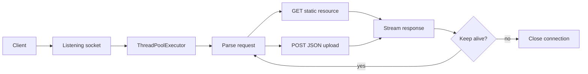

# Multi-threaded HTTP Server

A dependency-free HTTP/1.1 server built from scratch in Python. It uses raw
sockets and a configurable thread pool to serve static files, accept JSON
uploads, reuse persistent connections, and handle concurrent clients.

## What it implements

- `GET` for HTML, JSON, text, PNG, and JPEG resources
- `POST /upload` for JSON payloads
- HTTP/1.1 keep-alive connections with request and idle limits
- configurable host, port, and thread-pool size
- streamed binary transfers in 8 KiB chunks
- path-traversal and `Host` header checks
- request, error, and connection logging
- a 54-case client suite with three concurrent clients

## Quick start

Requirements: Python 3.8 or newer. No third-party packages are required.

```bash
git clone https://github.com/Raghavendra1729-cell/Multithreaded-Http-Server.git
cd Multithreaded-Http-Server
mkdir -p resources/uploads testing/downloads
python3 server.py
```

The default server listens at `http://127.0.0.1:8080` with 10 worker threads.
The sample site is available at `/`, with additional resources under
`resources/`.

To choose a different port, bind address, or pool size:

```bash
python3 server.py 9000
python3 server.py 8000 0.0.0.0 20
```

The positional arguments are `PORT`, `HOST`, and `MAX_THREADS`.

## Try the API

```bash
curl http://127.0.0.1:8080/
curl -O http://127.0.0.1:8080/logo.png
curl -X POST http://127.0.0.1:8080/upload \
  -H 'Content-Type: application/json' \
  -d '{"name":"example","value":42}'
```

Uploaded JSON files are written to `resources/uploads/`.

## Run the test suite

Keep the server running, then open a second terminal in the repository:

```bash
python3 testing/client.py
```

The suite starts three clients and covers static resources, binary integrity,
JSON parsing and upload, error responses, and concurrency. It writes its report
to [`testing/test_results.md`](testing/test_results.md).

## Request flow



| Setting | Default |
|---|---:|
| Bind address | `127.0.0.1` |
| Port | `8080` |
| Worker threads | `10` |
| Header limit | `8 KiB` |
| Stream chunk | `8 KiB` |
| Idle timeout | `30 seconds` |
| Requests per connection | `100` |

## Security boundaries

The server rejects parent-directory traversal, absolute paths, invalid or
missing `Host` headers, unsupported file extensions, unsupported methods, and
non-JSON uploads. Request headers are size-limited and idle clients time out.

This is an educational server, not a production edge server. It does not
provide TLS, authentication, compression, caching, HTTP/2, or multi-process
scaling.

## Project structure

```text
.
├── server.py              # Socket server and request handlers
├── resources/             # Sample site, downloads, and JSON uploads
├── testing/
│   ├── client.py          # Concurrent integration test client
│   ├── test_results.md    # Latest saved report
│   └── downloads/         # Files produced by the test client
└── logs/                  # Checked-in example logs
```
